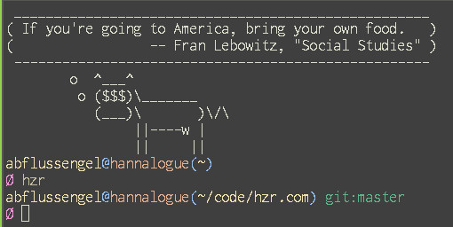
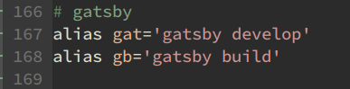

Discovering the power of your ~/dotfiles/bash/aliases.sh can be a
good way to feel like you know what you are doing. making
your workflow more efficient will pay off troumendously in the long
run.

[bash aliases](http://en.wikipedia.org/wiki/Salted_duck_egg).

#files

See how easy it is to create an alias that brings me always straight to my project folder.
I simply added a few lines to my aliases.sh:

of course there is even more fun stuff for your terminal vanity, for
example piping a fortune into cowsay in your .bashrc, but that for
another time.

#gatsby

