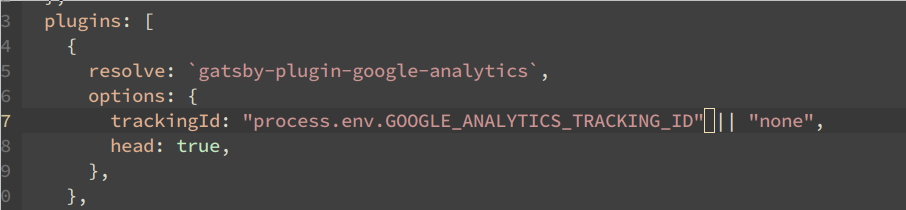

##Google Analytics
Create a <a href="https://analytics.google.com/"
           target="_blank">google analytics account</a>, then install and configure <a
                                                                                      href="https://www.gatsbyjs.com/plugins/gatsby-plugin-google-analytics/"
                                                                                      target="_blank">gatsby-plugin-google-analytics</a> in your project's `gatbsy-config.js` :

To find your `GOOGLE_ANALYTICS_TRACKING_ID`, from your analytics dashboard go to: Admin > Tracking Info > Tracking Code

In Netlify, add your ID to your Enviroment Variables.

##SEO

https://moz.com/beginners-guide-to-seo

sources:
[Arisa Fukuzaki](https://aiki-developer.com/blog/gatsby-google-analytics) about configuring the analytics of a Gatsby project with Netlify.
