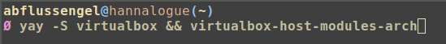
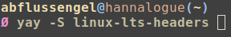
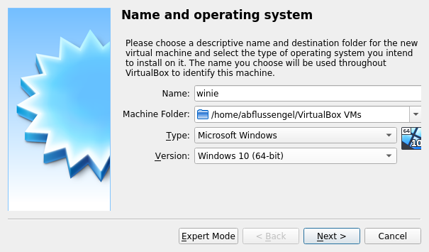
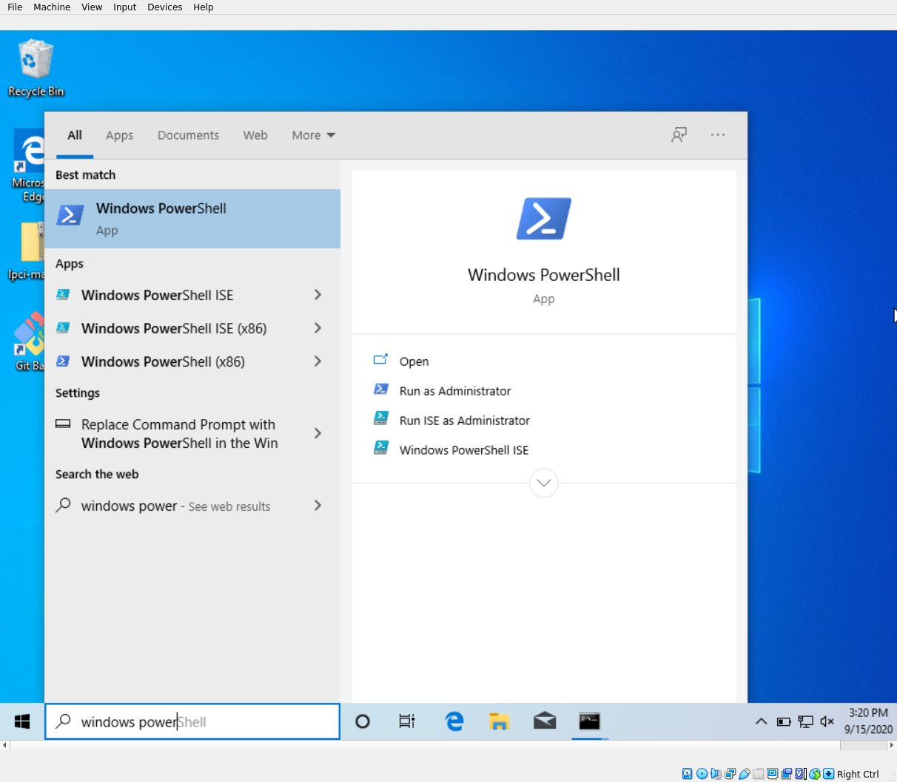
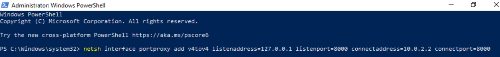
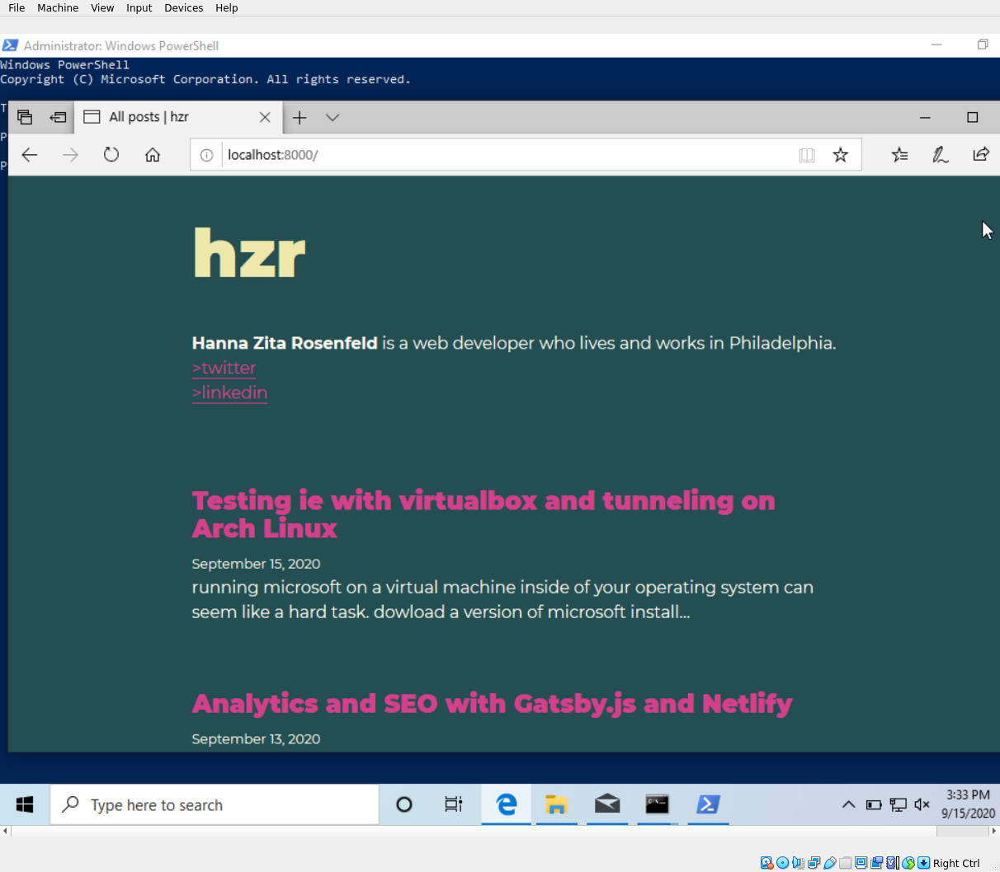

running microsoft on a virtual machine inside of your operating system can seem like a hard task.
there are cross browser testing sites, but those can be costly.
after i was presented with this headache, i decided to give virtualbox a go.
and as it turned out, it is actually fairly straight forward. let me run you through the steps:

## dowload a version of microsoft

in my case, [windows10](https://www.microsoft.com/en-us/software-download/windows10ISO)

## install virtualbox

either [here](https://www.virtualbox.org/)

#or using a package manager:
install `virtualbox` and `virtualbox-host-modules-arch`

install `linux-lts-headers` for `linux-lts`

## setup your virtual machine

click 'new' then name it and select the version of microsoft windows you want to test. In my case it was Windows 10.

When you are done creating your vm, you can boot it by clicking 'start'
After your system has booted up, seach for the `Windows PowerShell` and select `Run as Administrator`

## tunneling

Go ahead and run `netsh interface portproxy add v4tov4 listenaddress=127.0.0.1 listenport=8000 connectaddress=10.0.2.2 connectport=8000` in your shell. This command will allow you to use the localhost port to run a directory from your linux os.

Tada! How simple was that?

